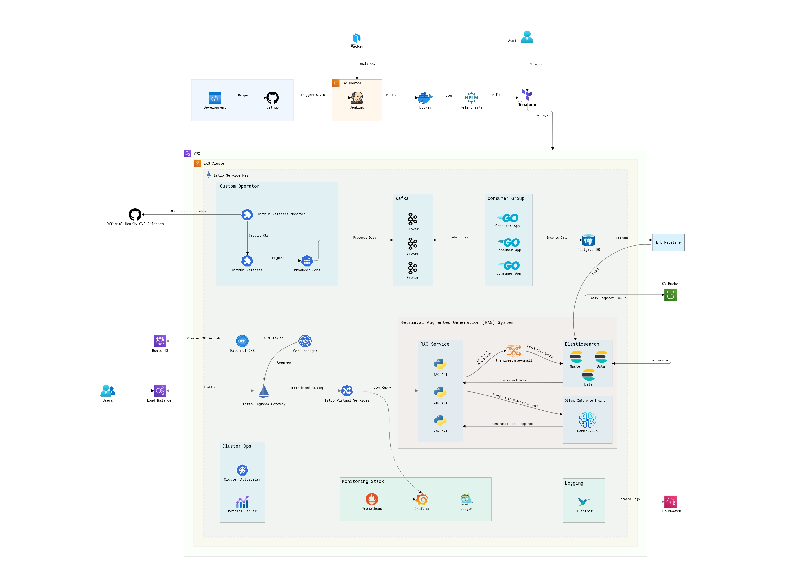

# ArchOps: CVE Data Processing and Analytics System

## Overview

This project orchestrates a distributed system for processing and analyzing Common Vulnerabilities and Exposures (CVE) data within a Kubernetes environment. It integrates Kafka for robust data streaming, PostgreSQL for scalable data storage, and a self-hosted Large Language Model (LLM) to enable advanced natural language querying. The system employs a Retrieval-Augmented Generation (RAG) pipeline to provide contextual, insightful responses to complex queries, ensuring efficient and comprehensive analysis of CVE data.

## Architecture

### Data Processing

The system employs a custom Kubernetes operator to monitor the [official CVE List V5](https://github.com/CVEProject/cvelistV5) GitHub repository for hourly CVE data releases. When a new release is detected, the operator triggers a resilient data processing pipeline. Kafka is used for fault-tolerant data streaming, efficiently distributing CVE data to consumers for processing.

#### Components

- **Kubernetes Operator**
  - **GitHubReleaseMonitor**: Monitors GitHub for CVE data releases and initiates the pipeline by creating GitHubRelease Custom Resources (CRs) for each release.
  - **GitHubRelease CR**: Represents a GitHub release and triggers the data ingestion process.
  - **Producer Job**: A Kubernetes Job associated with the GitHubRelease CR ingests CVE data into Kafka.

- **Kafka Cluster**
  - Multiple brokers ensures fault-tolerant streaming of CVE data.

- **Consumer Group**
  - Multiple consumers processes CVE data in parallel, manage versioning, and store data in PostgreSQL. The consumers auto-scale with HPA based on CPU utilization and adapt to Kafka rebalancing.

### Data Storage

CVE data is stored in PostgreSQL, designed to support versioning and historical tracking. The database leverages indexing to facilitate rapid queries and efficient data analysis, ensuring scalable performance over time.

### ETL Pipeline

The ETL pipeline efficiently manages CVE data through a three-step process:

1. **Extraction**: CVE data is extracted from PostgreSQL, ensuring that the most up-to-date and relevant information is used.

2. **Transformation**: The extracted data is transformed into high-dimensional embeddings using the `thenlper/gte-small` model from Hugging Face. This transformation encodes the data into a format suitable for similarity searches.

3. **Loading**: The transformed embeddings are then loaded into Elasticsearch, making the data accessible for the Retrieval-Augmented Generation (RAG) pipeline.

### Retrieval-Augmented Generation (RAG) Pipeline

The RAG pipeline leverages Elasticsearch and a self-hosted Large Language Model (LLM) to enable advanced natural language querying of CVE data.

- **Elasticsearch Cluster**: A highly available and scalable Elasticsearch cluster performs similarity searches using embeddings from the `thenlper/gte-small` model. It retrieves relevant CVE data to support accurate and comprehensive search results.

- **Large Language Model**: The self-hosted `Gemma-2-9B` LLM, running on GPU-powered node group which processes user queries based on the contextual data returned from Elasticsearch. This model generates detailed, context-aware responses, enhancing the quality and relevance of the information provided.

### Service Mesh

Istio is used as the service mesh to manage traffic flow, enforce security policies, and facilitate service discovery throughout the Kubernetes cluster.

### Logging

Fluentbit is used to collect and aggregate logs from across the cluster, forwarding them to AWS CloudWatch for centralized monitoring and comprehensive analysis.

### Monitoring

Prometheus is used to monitor metrics of the Kubernetes cluster and operational microservices. Grafana is used to visualize these metrics in real-time through interactive dashboards, offering insights into system performance, health, and operational status.

## Design and Implementation Considerations

### Scalability

The system is engineered for dynamic scaling at both pod and node levels:
- **Pod-Level Scaling**: Auto-scalers adjust the number of microservice replicas in response to fluctuating demand, ensuring optimal resource utilization and performance.
- **Node-Level Scaling**: The cluster employs a node-level auto-scaler to add or remove nodes based on overall resource needs, enhancing flexibility and efficiency.

### Availability

The system ensures high availability and fault tolerance through Kubernetes deployments, which manage multiple replicas of microservices. Pods are distributed across various AWS availability zones to mitigate the risk of single points of failure. Dedicated node groups are employed to handle general-purpose and GPU-intensive workloads efficiently.

### Reliability

Liveness and readiness probes are implemented for all microservices to ensure resilience. Kafka consumers utilize intelligent health checks to restart unhealthy consumers.

For further reading on Kafka consumer reliability, see:
- [Kafka Consumers on Kubernetes](https://oso.sh/blog/kafka-consumers-on-kubernetes/)
- [Intelligent Kafka Consumer Restarts](https://blog.cloudflare.com/intelligent-automatic-restarts-for-unhealthy-kafka-consumers)

### Security

The system adheres to the Principle of Least Privilege (PoLP) by implementing IAM roles, service accounts, RBAC, and network policies to minimize access and enhance security. SSL certificates secure traffic to the cluster and are managed by Kubernetes Cert Manager. External DNS automates DNS record creation in AWS Route 53, ensuring secure and efficient domain management.

## Deployment

Deployment is automated using Helm for Kubernetes application deployment and Terraform for infrastructure provisioning. Jenkins handles CI/CD pipelines, including Docker image builds and semantic versioning for applications and Helm packages.

## Contributors

- [Pritesh Nimje](https://github.com/PriteshNU)
- [Nitesh More](https://github.com/Nitesh-NEU)
